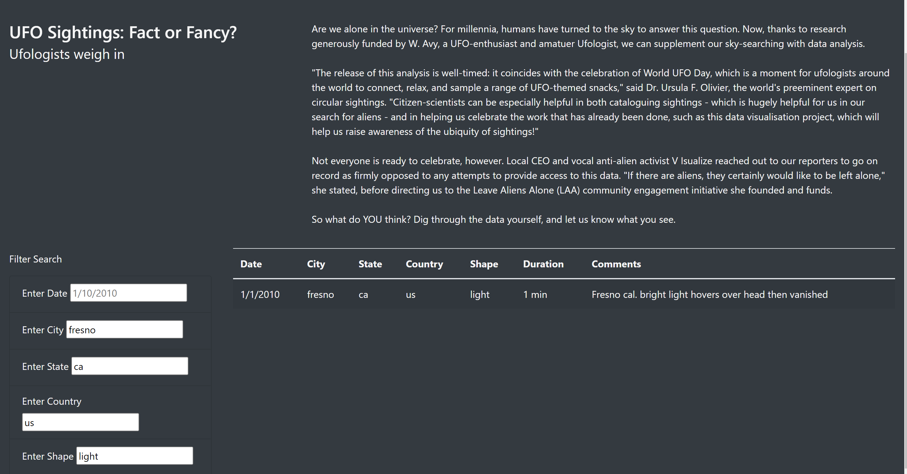
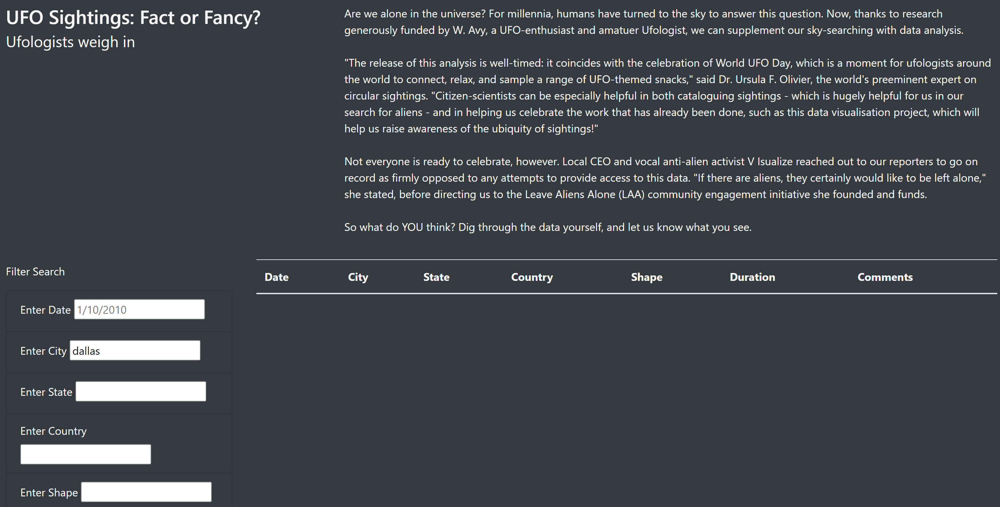

# UFOs 
## Overview of the analysis: 
This project is about an analysis of UFO sitghting for the users. In this analysis, we built a website utilizing JavaScript and HTML that enabled users to search UFO Sighting information/data using filter based on multiple criteria such as city, state, country, and/or shape. 

## Results: 
To use this website, the user will use the search criteria by typing in one or more of the search criteria. For example, if the user types in "fresno", "ca", "us", and "light" for the city name, state, country and shape, it will return the following result: 

If the information that the user types in the search criteria doesn't exist, the following result will be returned: 

## Summary:
There are some improvements areas. For example, it is not easy to start a new search. It's recomended to add buttons for clearing results or re-start the search. 

There are two additional recommendations for further development: 
1. as mentioned above, a functionality of starting a new search could be added to improve. 
2. another area I want to recommend to improve is to expand the dataset so it will not be limited to 2010 data, and also the UFO sighting data could be expanded to global information.  

